# 🏛️ Arquitetura e Diretrizes Técnicas — OmniBackend Android

O **OmniBackend Android** é a biblioteca corporativa de abstração Backend-as-a-Service (BaaS) e persistência em nuvem multi-provedor para aplicativos Android corporativos. Este documento detalha as decisões arquiteturais, o isolamento por camadas, os padrões de resiliência e as restrições invioláveis de engenharia.

---

## 🧭 Princípios Norteadores

1. **Arquitetura Hexagonal & Orientada a Contratos:**
   - O módulo agnóstico (`:core`) define as interfaces puras de domínio (`AuthRepository`, `FirestoreRepository`, `StorageRepository`, `AnalyticsRepository`, `PushNotificationRepository`, `RealtimeRepository`).
   - Módulos de aplicação e regras de negócio dependem exclusivamente desses contratos agnósticos, nunca de SDKs proprietários específicos de provedores (ex: Firebase, Supabase, AWS Amplify).
2. **Zero UI nas Camadas de Infraestrutura e Backend:**
   - Módulos agnósticos (`:core`, `:testing`), drivers especializados (`:backend:*`) e agregadores (`:bundle:*`) **NÃO** possuem dependências com Jetpack Compose ou componentes visuais.
   - Qualquer elemento visual reside exclusivamente no aplicativo consumidor ou em módulos do ecossistema `DesignSystemAndroid`.
3. **Distribuição em Três Níveis de Consumo:**
   - **Módulo Agnóstico (`:core`):** Contratos puros, modelos de dados neutros (`OmniUser`, `DataResult`, `AppError`), criptografia Keystore e orquestradores de resiliência.
   - **Drivers Especializados (`:backend:*`):** Implementações concretas e isoladas para cada provedor de nuvem (`firebase`, `supabase`, `appwrite`, `pocketbase`, `back4app`, `amplify`, `cloudflare`, `rest`).
   - **Bundles Agregadores (`:bundle:*`):** Pacotes temáticos pré-configurados com injeção Hilt pronta para uso (`all`, `hybrid`, `self-hosted`, `cloud-native`, `enterprise-hybrid`, `edge-serverless`, `baas-classic`, `firebase-supabase`, etc.).
4. **Resiliência e Alta Disponibilidade Nativas:**
   - Suporte nativo a failover multi-nuvem (`HybridAuthRepository`) com chaveamento ativo-passivo entre provedores.
   - Suporte a sincronização transparente e fila de mutações offline (`OfflineFirstRepository`, `MutationQueueManager`).
   - Criptografia AES-256-GCM via Android Keystore (`KeystoreCryptoManager`) para tokens e dados sensíveis em repouso.

---

## 🗺️ Mapa de Camadas e Dependências

```mermaid
graph TD
    classDef core fill:#FBBC04,stroke:#F29900,stroke-width:2px,color:#000;
    classDef driver fill:#34A853,stroke:#1E8E3E,stroke-width:2px,color:#fff;
    classDef bundle fill:#9C27B0,stroke:#7B1FA2,stroke-width:2px,color:#fff;
    classDef app fill:#4285F4,stroke:#1A73E8,stroke-width:2px,color:#fff;
    classDef test fill:#EA4335,stroke:#D93025,stroke-width:2px,color:#fff;

    App[":app<br/>(Showcase Interativo)"]:::app

    Core[":core<br/>(Contratos, Modelos Neutros, Criptografia, Offline-First)"]:::core
    Testing[":testing<br/>(Fakes em Memória, Mocks, Test Rules)"]:::test

    D_FB[":backend:firebase"]:::driver
    D_SB[":backend:supabase"]:::driver
    D_AW[":backend:appwrite"]:::driver
    D_PB[":backend:pocketbase"]:::driver
    D_B4A[":backend:back4app"]:::driver
    D_AMP[":backend:amplify"]:::driver
    D_CF[":backend:cloudflare"]:::driver
    D_REST[":backend:rest"]:::driver

    B_Hybrid[":bundle:hybrid"]:::bundle
    B_SelfHosted[":bundle:self-hosted"]:::bundle
    B_CloudNative[":bundle:cloud-native"]:::bundle
    B_All[":bundle:all"]:::bundle
    B_Pairs["Bundles de Pares Diretos<br/>(firebase-supabase, firebase-amplify...)"]:::bundle

    Testing --> Core
    D_FB --> Core
    D_SB --> Core
    D_AW --> Core
    D_PB --> Core
    D_B4A --> Core
    D_AMP --> Core
    D_CF --> Core
    D_REST --> Core

    B_Hybrid --> Core
    B_Hybrid --> D_FB
    B_Hybrid --> D_SB
    B_Hybrid --> D_AW

    B_SelfHosted --> Core
    B_SelfHosted --> D_SB
    B_SelfHosted --> D_AW
    B_SelfHosted --> D_PB
    B_SelfHosted --> D_B4A

    B_CloudNative --> Core
    B_CloudNative --> D_FB
    B_CloudNative --> D_SB
    B_CloudNative --> D_AMP
    B_CloudNative --> D_CF

    B_All --> Core
    B_All --> D_FB
    B_All --> D_SB
    B_All --> D_AW
    B_All --> D_PB
    B_All --> D_B4A
    B_All --> D_AMP
    B_All --> D_CF
    B_All --> D_REST

    B_Pairs --> Core

    App --> Core
    App --> B_Hybrid
    App --> Testing
```

---

## 🛡️ Padrões de Resiliência

### 1. Failover Ativo-Passivo (`HybridAuthRepository`)
Permite configurar um provedor primário (ex: Firebase) e um secundário de contingência (ex: Supabase). Se a requisição de login falhar no primário por indisponibilidade de rede ou erro de servidor (HTTP 5xx), o orquestrador tenta o secundário automaticamente, registrando a telemetria do failover.

### 2. Cache Offline e Fila de Mutações (`OfflineFirstRepository`)
Operações de leitura priorizam a cópia local criptografada para tempo de resposta sub-milissegundo. Escritas em momentos de conectividade instável são enfileiradas de forma durável na `MutationQueueManager` e sincronizadas com a nuvem assim que o `NetworkMonitor` detecta restabelecimento de rede.

### 3. Segurança em Repouso (`KeystoreCryptoManager`)
Todos os segredos em trânsito e em repouso utilizam chaves geradas dentro do hardware seguro do dispositivo (Android Keystore / StrongBox Keymaster), empregando AES-256 com GCM e verificação de integridade autenticada.

---

## 🔒 Regras de Governança e Inviolabilidade

1. **Proibição de `android.util.Log` em Produção:**
   - Mensagens de log devem ser roteadas via repositório de telemetria ou analytics.
2. **Proibição de Dependências de UI em Módulos Headless:**
   - O CI e os testes de fitness arquitetural (`ArchitectureFitnessTest`) barram qualquer commit que importe bibliotecas Compose em submódulos de infraestrutura.
3. **Versionamento Semântico Rígido (SemVer):**
   - Alterações nos contratos públicos em `:core` geram obrigatoriamente bump `MAJOR`.
   - Adição de novos métodos/drivers gera bump `MINOR`.
   - Correções internas e refatorações geram bump `PATCH`.
