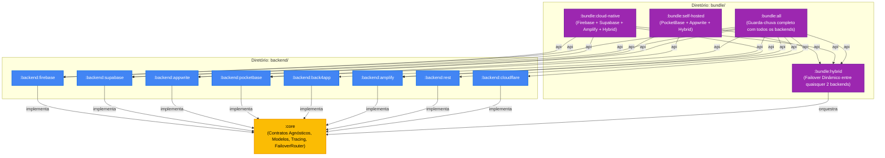

# OmniBackendAndroid 🚀

[](https://github.com/Gabriel-do-Carmo-97/OmniBackendAndroid/actions)
[](https://developer.android.com/)
[](https://kotlinlang.org/)
[](https://gradle.org/)
[](https://developer.android.com/build)
[](#qualidade-e-governança)

**OmniBackend Android** é um framework empresarial e agnóstico de abstração Backend-as-a-Service (BaaS) e orquestração de nuvem para Android. 

Permite que aplicativos corporativos operem com múltiplos provedores de backend (Firebase, Supabase, Appwrite, Back4App, PocketBase, Cloudflare, AWS Amplify e REST proprietário) com **Zero SDK Leakage** e suporte nativo a **Failover Automático / Redundância Ativo-Passivo**.

---

## 🏛️ Arquitetura Multi-Módulo Corporativa



---

## 📦 Matriz de Módulos e Artefatos

### 1. Núcleo Agnóstico (`core/`)
| Módulo | Artefato Maven | Descrição |
| :--- | :--- | :--- |
| **`:core`** | `br.wgc.omnibackend:core` | Contratos puros (`AuthRepository`, `FirestoreRepository`, `StorageRepository`), modelos `OmniUser`, `DataResult`, `AppError`, tracing distribuído e enfileiramento offline. |

### 2. Drivers Especializados (`backend/`)
| Módulo | Artefato Maven | Provedor / Nuvem | Capacidades Principais |
| :--- | :--- | :--- | :--- |
| **`:backend:firebase`** | `br.wgc.omnibackend:backend-firebase` | Google Cloud | Auth, Firestore, RTDB, Storage, Telemetria, AppCheck, Vertex AI. |
| **`:backend:supabase`** | `br.wgc.omnibackend:backend-supabase` | PostgreSQL / Supabase | GoTrue Auth, PostgREST CRUD, Realtime WebSocket, Storage. |
| **`:backend:appwrite`** | `br.wgc.omnibackend:backend-appwrite` | Appwrite Cloud / Docker | Account, Databases, Realtime Subscriptions, Storage. |
| **`:backend:pocketbase`** | `br.wgc.omnibackend:backend-pocketbase` | PocketBase (Go / SQLite) | RecordAuth, Collections CRUD, File Storage. |
| **`:backend:back4app`** | `br.wgc.omnibackend:backend-back4app` | Back4App / Parse | ParseUser, ParseObject Queries, ParseFile Storage. |
| **`:backend:amplify`** | `br.wgc.omnibackend:backend-amplify` | Amazon Web Services | AWS Cognito, DynamoDB API, S3 Storage. |
| **`:backend:rest`** | `br.wgc.omnibackend:backend-rest` | API Proprietária | JWT Auth, RFC 7807 ProblemDetails, Endpoints REST. |
| **`:backend:cloudflare`** | `br.wgc.omnibackend:backend-cloudflare` | Cloudflare Edge | Workers Auth, D1 SQL Database, R2 Object Storage. |

### 3. Bundles Agregadores (`bundle/`)
| Módulo | Artefato Maven | Propósito |
| :--- | :--- | :--- |
| **`:bundle:hybrid`** | `br.wgc.omnibackend:bundle-hybrid` | Motor de failover e roteamento agnóstico (`OmniHybrid`). Permite combinar **quaisquer dois provedores**. |
| **`:bundle:self-hosted`** | `br.wgc.omnibackend:bundle-self-hosted` | Solução para empresas que usam servidores próprios (PocketBase + Appwrite + Hybrid). |
| **`:bundle:cloud-native`** | `br.wgc.omnibackend:bundle-cloud-native` | Multi-cloud em hiperescala (Google Cloud + AWS + Supabase + Hybrid). |
| **`:bundle:all`** | `br.wgc.omnibackend:bundle-all` | Pacote completo com todos os 8 drivers integrados. |

---

## ⚡ Instalação & Consumo via GitHub Packages

Adicione o repositório no seu `settings.gradle.kts`:

```kotlin
dependencyResolutionManagement {
    repositories {
        google()
        mavenCentral()
        maven {
            name = "GitHubPackages"
            url = uri("https://maven.pkg.github.com/Gabriel-do-Carmo-97/OmniBackendAndroid")
            credentials {
                username = providers.gradleProperty("gpr.user").orNull ?: System.getenv("GITHUB_ACTOR")
                password = providers.gradleProperty("gpr.key").orNull ?: System.getenv("GITHUB_TOKEN")
            }
        }
    }
}
```

### Exemplo 1: Uso com Failover Ativo-Passivo (Redundância)
```kotlin
// build.gradle.kts do seu app:
dependencies {
    implementation("br.wgc.omnibackend:bundle-hybrid:0.0.x")
    implementation("br.wgc.omnibackend:backend-firebase:0.0.x")
    implementation("br.wgc.omnibackend:backend-supabase:0.0.x")
}

// No seu Application ou Módulo DI:
val database = OmniHybrid.createDatabase(
    primary = OmniFirebase.firestore,
    secondary = OmniSupabase.database
)

// Se o Firebase falhar ou der timeout de rede, o Supabase assume transparentemente!
```

---

## 🛡️ Qualidade e Governança
* **Detekt Static Analysis**: Regras estritas sem supressões não justificadas.
* **100% KDoc**: Toda classe, método e contrato público documentado.
* **Zero SDK Leakage**: Interfaces do `:core` isolam completamente os SDKs de terceiros.
* **Conventional Commits**: Padronização estrita de PRs e tags automáticas (`v0.0.<run_number>`).

Consulte [CONTRIBUTING.md](CONTRIBUTING.md) para diretrizes de desenvolvimento e [SECURITY.md](SECURITY.md) para nossa política de divulgação responsável de vulnerabilidades.
