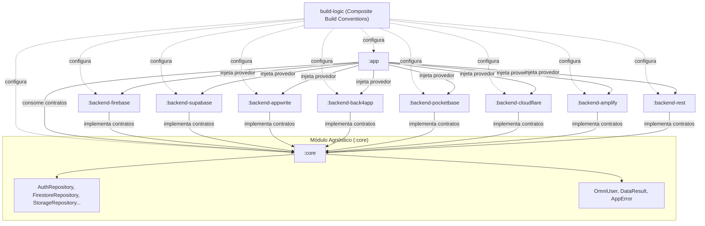

# OmniBackendAndroid

[](https://developer.android.com/)
[](https://kotlinlang.org/)
[](https://gradle.org/)
[](https://developer.android.com/build)
[](#architecture)

**OmniBackend Android** é uma solução empresarial multi-provedor de abstração Backend-as-a-Service (BaaS) para aplicativos Android. Desacopla o aplicativo de provedores específicos (Firebase, Supabase, Appwrite, Back4App, PocketBase, Cloudflare, AWS Amplify, Custom REST) por meio de contratos de domínio limpos, reativos e totalmente agnósticos.

---

## 🏛️ Arquitetura do Projeto



---

## 📦 Módulos do Framework

| Módulo | Tipo | Documentação | Descrição |
| :--- | :---: | :---: | :--- |
| **`build-logic`** | Composite Build | [README.md](file:///C:/Users/gcarm/AndroidStudioProjects/OmniBackendAndroid/build-logic/README.md) | Convention Plugins Gradle unificando AGP 9.3.2 e Kotlin. |
| **`:core`** | Android Library | [README.md](file:///C:/Users/gcarm/AndroidStudioProjects/OmniBackendAndroid/core/README.md) | Núcleo agnóstico contendo contratos, modelos `OmniUser`, `DataResult` e `AppError`. **Zero dependências externas.** |
| **`:backend-firebase`** | Android Library | [README.md](file:///C:/Users/gcarm/AndroidStudioProjects/OmniBackendAndroid/backend-firebase/README.md) | Driver do Google Firebase (Auth, Firestore, RTDB, Storage, Telemetria, AppCheck, Vertex AI). |
| **`:backend-supabase`** | Android Library | [README.md](file:///C:/Users/gcarm/AndroidStudioProjects/OmniBackendAndroid/backend-supabase/README.md) | Driver do Supabase (GoTrue Auth, PostgREST, Storage, Realtime). |
| **`:backend-appwrite`** | Android Library | [README.md](file:///C:/Users/gcarm/AndroidStudioProjects/OmniBackendAndroid/backend-appwrite/README.md) | Driver do Appwrite (Account, Databases & Realtime WebSockets, Storage). |
| **`:backend-back4app`** | Android Library | [README.md](file:///C:/Users/gcarm/AndroidStudioProjects/OmniBackendAndroid/backend-back4app/README.md) | Driver do Back4App / Parse Platform (`ParseUser`, `ParseObject`, `ParseFile`). |
| **`:backend-pocketbase`** | Android Library | [README.md](file:///C:/Users/gcarm/AndroidStudioProjects/OmniBackendAndroid/backend-pocketbase/README.md) | Driver do PocketBase (RecordAuth, Collections, Files). |
| **`:backend-cloudflare`** | Android Library | [README.md](file:///C:/Users/gcarm/AndroidStudioProjects/OmniBackendAndroid/backend-cloudflare/README.md) | Driver da Cloudflare (Workers Auth/API, D1 Database, R2 Storage). |
| **`:backend-amplify`** | Android Library | [README.md](file:///C:/Users/gcarm/AndroidStudioProjects/OmniBackendAndroid/backend-amplify/README.md) | Driver da AWS Amplify (Cognito, DynamoDB/AppSync, S3 Storage). |
| **`:backend-rest`** | Android Library | [README.md](file:///C:/Users/gcarm/AndroidStudioProjects/OmniBackendAndroid/backend-rest/README.md) | Driver REST customizado/proprietário com suporte a JWT e RFC 7807. |
| **`:app`** | Android Application | [README.md](file:///C:/Users/gcarm/AndroidStudioProjects/OmniBackendAndroid/app/README.md) | Aplicativo de demonstração consumindo os contratos do `:core` e trocando de provedor. |

---

## ⚡ Guia Rápido de Inicialização

### 1. Selecionar o Provedor Desejado

No `build.gradle.kts` do seu aplicativo (`:app`):

```kotlin
dependencies {
    implementation(project(":core"))
    implementation(project(":backend-firebase")) // ou :backend-supabase, :backend-appwrite, etc.
}
```

### 2. Inicializar a Facade no `Application.onCreate()`

```kotlin
class MainApplication : Application() {
    override fun onCreate() {
        super.onCreate()

        // Exemplo: Inicializando o Firebase
        OmniFirebase.initialize(context = this)

        // Ou Supabase: OmniSupabase.initialize(this, url = "...", anonKey = "...")
        // Ou Appwrite: OmniAppwrite.initialize(this, endpoint = "...", projectId = "...", databaseId = "...")
    }
}
```

### 3. Consumir a Camada Agnóstica de Domínio

```kotlin
class UserViewModel(
    private val authRepository: AuthRepository // Injetado via Hilt, Koin ou Facade
) : ViewModel() {

    val userFlow: Flow<OmniUser?> = authRepository.authState

    suspend fun login(email: String, pass: String) {
        val result: DataResult<OmniUser> = authRepository.login(email, pass)
        when (result) {
            is DataResult.Success -> println("Usuário autenticado: ${result.data.displayName}")
            is DataResult.Failure -> println("Erro: ${result.error}")
        }
    }
}
```

---

## 🧪 Testes e Compilação

Executar a suíte completa de testes unitários em todos os módulos:

```bash
./gradlew testDebugUnitTest
```

Gerar documentação em HTML das APIs com o Dokka:

```bash
./gradlew dokkaGenerate
```
