# OmniBackendAndroid

[](https://developer.android.com/)
[](https://kotlinlang.org/)
[](https://gradle.org/)
[](https://developer.android.com/build)
[](#architecture)

**OmniBackend Android** é uma solução empresarial multi-provedor de abstração Backend-as-a-Service (BaaS) para aplicativos Android. Desacopla o aplicativo de provedores específicos por meio de contratos de domínio limpos, reativos e totalmente agnósticos.

---

## 🏛️ Arquitetura do Projeto

```mermaid
graph TD
    BL["build-logic (Composite Build)"] -.->|configura| App[":app"]
    BL -.->|configura| Core[":core"]
    BL -.->|configura| Drivers["backend/* Drivers"]
    BL -.->|configura| Bundles["bundle/* Aggregators"]

    App -->|consome| Bundles
    App -->|consome| Core

    subgraph "Módulo Agnóstico (:core)"
        Core --> Contracts["AuthRepository, FirestoreRepository, StorageRepository..."]
        Core --> Resilient["OfflineFirstRepository, HybridAuthRepository, KeystoreCryptoManager"]
    end

        subgraph "Agregadores Inteligentes (bundle/*)"
        Bundles --> BAll[":bundle:all"]
        Bundles --> BHyb[":bundle:hybrid"]
        Bundles --> BSelf[":bundle:self-hosted"]
        Bundles --> BCloud[":bundle:cloud-native"]
        Bundles --> BEnt[":bundle:enterprise-hybrid"]
        Bundles --> BEdge[":bundle:edge-serverless"]
        Bundles --> BClassic[":bundle:baas-classic"]
        Bundles --> BFS[":bundle:firebase-supabase"]
        Bundles --> BFA[":bundle:firebase-amplify"]
        Bundles --> BFB[":bundle:firebase-back4app"]
        Bundles --> BSC[":bundle:supabase-cloudflare"]
    end

    subgraph "Drivers Especializados (backend/*)"
        Drivers --> D1[":backend:firebase"]
        Drivers --> D2[":backend:supabase"]
        Drivers --> D3[":backend:appwrite"]
        Drivers --> D4[":backend:pocketbase"]
        Drivers --> D5[":backend:back4app"]
        Drivers --> D6[":backend:amplify"]
        Drivers --> D7[":backend:cloudflare"]
        Drivers --> D8[":backend:rest"]
    end
```



---

## 📦 Módulos Bundles (Agregadores Inteligentes)

[Veja a Documentação Completa dos Bundles](file:///C:/Users/gcarm/AndroidStudioProjects/OmniBackendAndroid/bundle/README.md)

| Módulo Bundle | Dependência Maven | Para Que Serve? | Quando Usar? |
| :--- | :--- | :--- | :--- |
| **`all`** | `implementation("br.wgc.omnibackend:bundle-all:1.0.0")` | **Suíte Completa:** Inclui TODOS os 8 drivers de backend. | Prototipagem, testes integrados ou super-apps. |
| **`hybrid`** | `implementation("br.wgc.omnibackend:bundle-hybrid:1.0.0")` | **Alta Disponibilidade e Failover:** Firebase + Supabase + Appwrite. | Apps críticos (bancos, e-commerce, saúde) com zero perda de dados. |
| **`self-hosted`** | `implementation("br.wgc.omnibackend:bundle-self-hosted:1.0.0")` | **Auto-Hospedado / Open Source:** Supabase, Appwrite, PocketBase, Back4App. | Governança LGPD/GDPR, redes privadas VPN ou servidor On-Premise. |
| **`cloud-native`** | `implementation("br.wgc.omnibackend:bundle-cloud-native:1.0.0")` | **Nuvens Públicas Globais:** Firebase, Supabase, AWS Amplify, Cloudflare. | Startups B2C de escala massiva e auto-scaling elástico. |
| **`enterprise-hybrid`** | `implementation("br.wgc.omnibackend:bundle-enterprise-hybrid:1.0.0")` | **Nuvem Híbrida & Legado:** AWS Amplify, Cloudflare, Custom REST, Firebase. | Empresas com APIs REST/SOAP legadas internas em transição para nuvem. |
| **`edge-serverless`** | `implementation("br.wgc.omnibackend:bundle-edge-serverless:1.0.0")` | **Borda de Ultra-Baixa Latência:** Cloudflare, PocketBase, Custom REST. | Apps IoT, respostas em milissegundos e serverless em borda. |
| **`baas-classic`** | `implementation("br.wgc.omnibackend:bundle-baas-classic:1.0.0")` | **BaaS Tradicionais:** Firebase, Appwrite, Back4App. | Foco em máxima velocidade de entrega (Time-to-Market) e MVPs. |
| **`firebase-supabase`** | `implementation("br.wgc.omnibackend:bundle-firebase-supabase:1.0.0")` | **Par Pré-Configurado:** Google Firebase + Supabase (PostgreSQL). | Failover ativo-passivo direto entre GCP Firebase e Supabase. |
| **`firebase-amplify`** | `implementation("br.wgc.omnibackend:bundle-firebase-amplify:1.0.0")` | **Par Multi-Cloud:** Google Firebase + AWS Amplify (GCP + AWS). | Redundância corporativa direta entre os dois maiores gigantes da nuvem. |
| **`firebase-back4app`** | `implementation("br.wgc.omnibackend:bundle-firebase-back4app:1.0.0")` | **Par Híbrido:** Google Firebase + Back4App (Parse Platform). | Contingência robusta entre ecossistema Google e infraestrutura Parse. |
| **`supabase-cloudflare`** | `implementation("br.wgc.omnibackend:bundle-supabase-cloudflare:1.0.0")` | **Par Edge & Dados:** Supabase (PostgreSQL) + Cloudflare Edge (Workers/D1/R2). | Apps com dados relacionais robustos e computação de borda de baixa latência. |

---

## 🏎️ Drivers Especializados (`backend/*`)

Se você desejar importar apenas 1 único provedor específico para minimizar o tamanho do APK:

- [**:core**](file:///C:/Users/gcarm/AndroidStudioProjects/OmniBackendAndroid/core/README.md) — Núcleo puro e agnóstico de domínio.
- [**:backend:firebase**](file:///C:/Users/gcarm/AndroidStudioProjects/OmniBackendAndroid/backend/firebase/README.md) — Google Firebase BoM 33.9.0.
- [**:backend:supabase**](file:///C:/Users/gcarm/AndroidStudioProjects/OmniBackendAndroid/backend/supabase/README.md) — Supabase Kotlin SDK 3.1.3.
- [**:backend:appwrite**](file:///C:/Users/gcarm/AndroidStudioProjects/OmniBackendAndroid/backend/appwrite/README.md) — Appwrite Android SDK 24.1.1.
- [**:backend:pocketbase**](file:///C:/Users/gcarm/AndroidStudioProjects/OmniBackendAndroid/backend/pocketbase/README.md) — PocketBase Go/SQLite.
- [**:backend:back4app**](file:///C:/Users/gcarm/AndroidStudioProjects/OmniBackendAndroid/backend/back4app/README.md) — Back4App / Parse Platform SDK 4.4.0.
- [**:backend:amplify**](file:///C:/Users/gcarm/AndroidStudioProjects/OmniBackendAndroid/backend/amplify/README.md) — AWS Amplify (Cognito, DynamoDB, S3).
- [**:backend:cloudflare**](file:///C:/Users/gcarm/AndroidStudioProjects/OmniBackendAndroid/backend/cloudflare/README.md) — Cloudflare Workers, D1 Database, R2 Storage.
- [**:backend:rest**](file:///C:/Users/gcarm/AndroidStudioProjects/OmniBackendAndroid/backend/rest/README.md) — Custom REST API (JWT & RFC 7807).

---

## ⚡ Guia Rápido de Uso do Bundle Híbrido

### 1. Importar o Bundle no `build.gradle.kts`
```kotlin
dependencies {
    implementation(project(":bundle:hybrid"))
}
```

### 2. Inicialização com Fallback no `Application.onCreate()`
```kotlin
class MainApplication : Application() {
    override fun onCreate() {
        super.onCreate()

        // Inicializa o Bundle Híbrido
        OmniHybrid.initialize(
            context = this,
            primaryProvider = "firebase",
            secondaryProvider = "supabase"
        )
    }
}
```

### 3. Consumo Transparente no ViewModel
```kotlin
class UserViewModel(
    private val auth: AuthRepository = OmniHybrid.auth
) : ViewModel() {
    // Tenta o login no Firebase; se falhar na rede, troca automaticamente para o Supabase!
}
```

---

## 🧪 Testes e Compilação

Executar a suíte completa de testes unitários em todos os módulos:

```bash
./gradlew testDebugUnitTest
```

Executar o linter Detekt e gerar a documentação web da API com Dokka:

```bash
./gradlew detekt dokkaGeneratePublicationHtml
```
