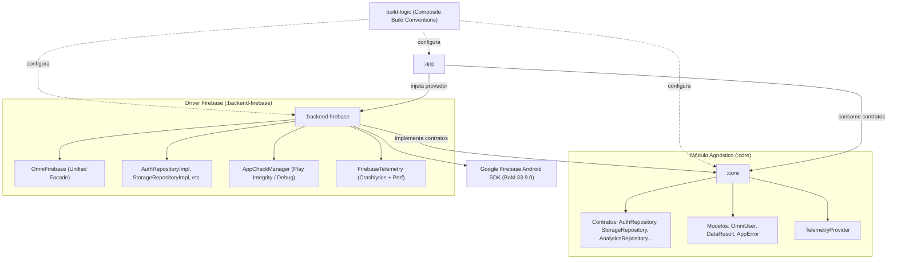

# OmniBackendAndroid

[](https://developer.android.com/)
[](https://kotlinlang.org/)
[](https://gradle.org/)
[](https://developer.android.com/build)
[](#architecture)

**OmniBackend Android** is an enterprise-grade, multi-provider Backend-as-a-Service (BaaS) abstraction framework for Android applications. It decouples client applications from specific cloud vendors (Firebase, Supabase, Appwrite, etc.) through clean, reactive, and cloud-agnostic domain contracts.

---

## 🏛️ Project Architecture



---

## 📦 Modules

| Module | Type | Description |
| :--- | :---: | :--- |
| **`build-logic`** | Composite Build | Plugins de convenção Gradle (`omni.android.application`, `omni.android.application.compose`, `omni.android.library`) unificando compilação e configurações do AGP 9.3.2. |
| **`:core`** | Android Library | Camada de domínio agnóstica contendo interfaces (`AuthRepository`, `StorageRepository`, `AnalyticsRepository`), modelos (`OmniUser`), resultados (`DataResult`) e hierarquia de erros (`AppError`). **Zero dependências de terceiros.** |
| **`:backend-firebase`** | Android Library | Driver do Firebase implementando os contratos do `:core` usando Firebase BoM 33.9.0, App Check (Play Integrity) e Telemetria (Crashlytics/Perf). |
| **`:app`** | Android Application | Aplicativo de demonstração consumindo `:core` e injetando `:backend-firebase`. |

---

## ⚡ Quick Start

### 1. Injetar ou Utilizar no Aplicativo

No seu módulo de apresentação (`:app`), declare:

```kotlin
dependencies {
    implementation(project(":core"))
    implementation(project(":backend-firebase"))
}
```

### 2. Inicialização

No `Application.onCreate()` ou `MainActivity.onCreate()`:

```kotlin
class MainApplication : Application() {
    override fun onCreate() {
        super.onCreate()

        OmniFirebase.initialize(
            context = this,
            enableAppCheck = true,
            isDebug = BuildConfig.DEBUG
        )
    }
}
```

### 3. Consumindo os Contratos do `:core`

```kotlin
class UserProfileViewModel : ViewModel() {

    // Sessão reativa agnóstica de usuário
    val currentUserFlow: Flow<OmniUser?> = OmniFirebase.auth.authState

    // Salvar documento
    suspend fun saveProfile(user: OmniUser) {
        val result: DataResult<String> = OmniFirebase.firestore.addDocument("users", user, user.uid)
        when (result) {
            is DataResult.Success -> println("Documento salvo: ${result.data}")
            is DataResult.Failure -> OmniFirebase.telemetry.recordError(result.error)
        }
    }
}
```

---

## 🧪 Testes e Compilação

Executar todos os testes unitários em todos os módulos:

```bash
./gradlew testDebugUnitTest
```

Compilar os AARs de `:core`, `:backend-firebase` e o APK do `:app`:

```bash
./gradlew assembleDebug
```
