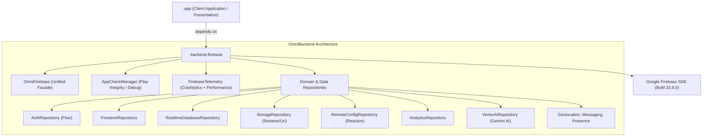

# OmniBackendAndroid

[](https://developer.android.com/)
[](https://kotlinlang.org/)
[](https://gradle.org/)
[](https://developer.android.com/build)
[](#architecture)

OmniBackend Android is an enterprise-ready, multi-provider Backend-as-a-Service (BaaS) abstraction architecture for Android applications. It enables applications to consume cloud providers (Firebase, Supabase, etc.) with clean, reactive, and unified interfaces.

---

## 🏛️ Project Architecture



---

## 🚀 Providers

| Provider Module | Status | Features |
| :--- | :---: | :--- |
| **`:backend-firebase`** | ✅ **Active** | Auth (reactive), Firestore, Realtime DB, Storage, Config, Analytics, Gemini AI, App Check (Play Integrity), Telemetry |
| **`:backend-supabase`** | 🔜 *Planned* | GoTrue Auth, PostgREST, Storage, Realtime CDC |

---

## ⚡ Quick Start with `:backend-firebase`

### 1. Add dependency in your `app/build.gradle.kts`:

```kotlin
dependencies {
    implementation(project(":backend-firebase"))
}
```

### 2. Initialize in `Application` or `MainActivity`:

```kotlin
class MainApplication : Application() {
    override fun onCreate() {
        super.onCreate()

        OmniFirebase.initialize(
            context = this,
            enableAppCheck = true,
            isDebug = BuildConfig.DEBUG
        )
    }
}
```

### 3. Consume via `OmniFirebase` Facade:

```kotlin
class UserProfileViewModel : ViewModel() {

    // Reactive user session
    val currentUser = OmniFirebase.auth.authState

    // Firestore CRUD
    suspend fun saveProfile(user: UserProfile) {
        OmniFirebase.firestore.addDocument("users", user, user.id)
    }

    // Telemetry & Error reporting
    fun handleError(error: AppError) {
        OmniFirebase.telemetry.recordError(error)
    }
}
```

---

## 🧪 Testing

Execute tests across all modules:

```bash
./gradlew testDebugUnitTest
```

Execute tests specifically for `:backend-firebase`:

```bash
./gradlew :backend-firebase:testDebugUnitTest
```
